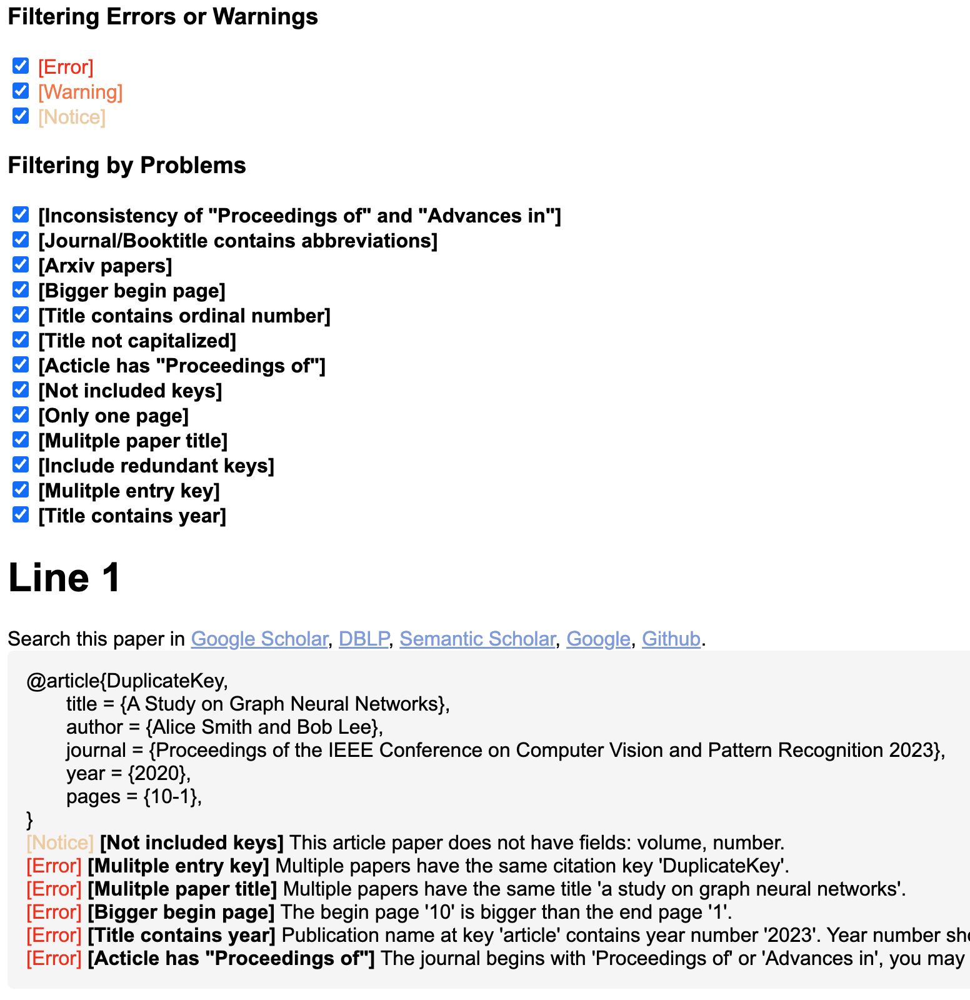

# Bib File Checker 🛠️

A comprehensive validation tool for LaTex .bib files that ensures academic references follow consistent formatting standards.

## 🚀 Usage

### 🔧 Command-Line Interface

You can run the validator from the command line using:

```bash
# Basic usage with default paths (input.bib and output.html)
python main.py

# Specify input and output files
python main.py --input=references.bib --output=validation_report.html

# Shorthand version
python main.py -i refs.bib -o out.html
```

## ✨ Features

### 🔍 Structural Validation
| Rule | Description | Severity |
|------|-------------|----------|
| Required Fields | Checks for missing essential fields:<br>- `@article`: `title`, `author`, `journal`, `year`, `pages`<br>- `@inproceedings`: `title`, `author`, `booktitle`, `year`, `pages` | ERROR |
| Recommended Fields | Flags missing but useful fields:<br>- `@article`: `volume`, `number` | NOTICE |
| Redundant Fields | Identifies unnecessary fields for specific entry types (e.g., `address` and `publisher`) | ERROR |

### 🔗 Citation Integrity
| Rule | Description | Severity |
|------|-------------|----------|
| Duplicate Keys | Detects identical citation keys | ERROR |
| Duplicate Titles | Flags papers with identical titles | ERROR |

### 📑 Page Formatting
| Rule | Description | Severity |
|------|-------------|----------|
| Page Range | Validates "start--end" format (e.g., "1--20") | ERROR |
| Page Order | Ensures start ≤ end page numbers | ERROR |
| Single Page | Detects single-page entries (e.g., "5") | WARNING |

### 📅 Year & Number Formatting
| Rule | Description | Severity |
|------|-------------|----------|
| Year Placement | Ensures years only appear in `year` field | ERROR |
| Ordinal Numbers | Flags ordinals (e.g., "42nd") in titles | NOTICE |

### 🏛️ Publication Standards
| Rule | Description | Severity |
|------|-------------|----------|
| Capitalization | Checks title-case for journal/conference names | NOTICE |
| Abbreviations | Detects inconsistent abbreviations (e.g., "Proc." vs "Proceedings") | NOTICE |
| Naming Conventions | Validates "Proceedings of" vs "Advances in" usage | NOTICE/ERROR |

### 📚 Special Cases
| Rule | Description | Severity |
|------|-------------|----------|
| arXiv Papers | Flags arXiv preprints needing publication info (before/after `current year - 1`) | WARNING/NOTICE |
| Entry Types | Ensures valid entry types: `@article`, `@inproceedings`, partial support for `@book` | ERROR |


## 🖼️ HTML Report


## 🧭 Coming Soon

We're actively working on expanding the capabilities of Bib File Checker. Here are some upcoming features you can expect in future releases:

1. **Automatic .bib File Correction**  
   Generate a cleaned and corrected version of your `.bib` file with recommended fixes applied automatically.

2. **Customizable Validation Rules**  
   Allow users to define which rules to enforce or ignore via a configuration file—e.g., skipping specific abbreviation checks or required fields.

3. **TeX Reference Cross-Checking**  
   Compare BibTeX entries against citations used in `.tex` files to flag unused or missing references.

4. **Advanced Error Detection**  
   Introduce support for additional error types and edge cases to further improve reference quality and formatting compliance.


## ✅ Why Use This?

- 🔄 **Automated Consistency Checking**: Save hours of manual formatting and BibTeX cleanup.
- 🧪 **Catch Common Errors Early**: Avoid peer-review rejections due to malformed or inconsistent references.
- 🤝 **Team Collaboration**: Ensures shared `.bib` files stay clean and error-free in large research projects.
